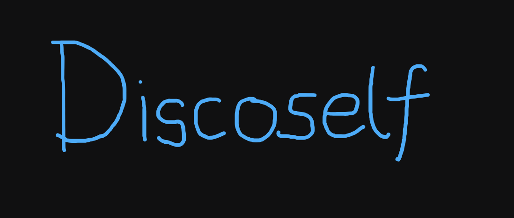

# discoself

[](https://pkg.go.dev/github.com/krishnassh/discoself)
[](https://goreportcard.com/report/github.com/krishnassh/discoself)


## Getting Started

### Installing

This assumes you already have a working Go environment, if not please see
[this page](https://golang.org/doc/install) first.

`go get` will always pull the latest tagged release from the main branch.

```sh
go get github.com/krishnassh/discoself
```

To update to the latest version:

```sh
go get -u github.com/krishnassh/discoself
```

### Usage

Import the package into your project.

```go
import discoself "github.com/krishnassh/discoself"
```

Create a new client and connect to the Discord gateway.

```go
client := discoself.NewClient("user-token", nil)
if err := client.Connect(); err != nil {
    log.Fatal(err)
}
defer client.Close()
```

See [API Reference](docs/api.md) and Examples below for more detailed information.

## Examples

**Sending a message:**

```go
client := discoself.NewClient("user-token", nil)
client.Connect()
defer client.Close()

client.SendMessage("channel-id", "Hello from discoself!")
```

**Replying to a message:**

```go
client.SendMessageWithReply("channel-id", "Hello!", "message-id-to-reply-to")
```

**Editing and deleting messages:**

```go
client.EditMessage("channel-id", "message-id", "updated content")
client.DeleteMessage("channel-id", "message-id")
```

**Adding a reaction:**

```go
client.AddReaction("channel-id", "message-id", "🐢")
```

**Sending a typing indicator:**

```go
client.SendTyping("channel-id")
```

**Sending a slash command:**

```go
client.SendSlashCommand("channel-id", "guild-id", command)
```

**Sending a slash command with options:**

```go
discord.SendSlashCommandWithOptions(gateway, "channel-id", "guild-id", command, []any{"option1", "option2"})
```

**Clicking a button:**

```go
discord.ClickButton(gateway, &messageEvent, "interaction-id")
```

**Fetching slash commands in a guild:**

```go
commands, err := discord.GetSlashCommands(gateway, "guild-id")
```

**Fetching your own slash commands:**

```go
commands, err := discord.GetUserSlashCommands(gateway)
```

**Listening for events:**

```go
package main

import (
	"fmt"
	"log"
	"os"
	"os/signal"
	"syscall"

	discoself "github.com/krishnassh/discoself"
)

func main() {
	client := discoself.NewClient("user-token", nil)

	client.AddHandler("MESSAGE_CREATE", func(data any) {
		fmt.Println("new message:", data)
	})

	if err := client.Connect(); err != nil {
		log.Fatal(err)
	}
	defer client.Close()

	fmt.Println("running.")
	stop := make(chan os.Signal, 1)
	signal.Notify(stop, syscall.SIGINT, syscall.SIGTERM)
	<-stop
}
```

**Fetching guild members:**

```go
client.GetMembers("guild-id", []string{"user-id-1", "user-id-2"})
```

## API Reference

For full documentation of every function, type, and utility see [docs/api.md](docs/api.md).

## Contributing

Contributions are very welcomed, however please follow the below guidelines.

- First open an issue describing the bug or enhancement so it can be discussed.
- Try to match current naming conventions as closely as possible.
- This package is intended to be a low level direct mapping of the Discord client API, so please avoid adding enhancements outside of that scope without first discussing it.
- Create a Pull Request with your changes against the main branch.

## Disclaimer

discoself interacts with the Discord client API in ways that are outside Discord's official bot platform. Use of selfbots violates [Discord's Terms of Service](https://discord.com/terms). I am not responsible for any misuse of this project or any consequences that may arise from its use.